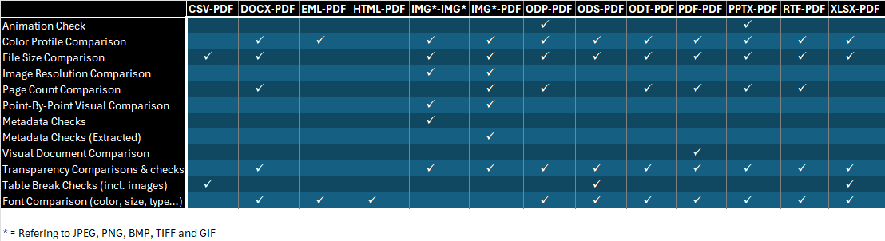

# conv-file-quality-assurance
This application performs quality checks on files mostly for files converted from a fileformat to an archival format. 
The checks consists of metadata, size, color space, pixelvalue, fonts, number of pages and animations. 


## Comparing methods
* File Size: Compares the file sizes of each file.

* Pixel by pixel: Checks every pixel in an image against another image. It calculates the eucludian distance between the colors of each pixel.

* Color Space: Checks for missing or different color spaces. 

* Fonts: Checks for missing or different fonts.

* Number of pages: Checks for missing or extra pages.

* Animations: Checks if a presentation format includes animations.

* Image resolution: Checks for different resolution in images.

* Visual Document comparison: Performs a visual comparison of images of pages of the document, done by comparing the position of elements on the page and pixel by pixel comparison of sectioned where it is deemed necessary.

* Transparency checks: Checks if images or text-document include transparancy. 

* Table break checks: Checks if spreadsheet formats converted to PDF have too wide tables/images result in the result being spread over several pages (NOTE: Currently works only when the result has standard PDF page size). 

* Metadata checks: Checks for missing or different metadata on images. Resolution, color type, bit depth and physical printing dimentions are directly compared, missing or newly created metadata are only noted.

* Metadata checks (extracted): Extracts images from PDF, OpenOffice and Microsoft Office files and checks for missing or different metadata. (NOTE: This method was added very recently and seems to trigger very often. We are considering lowering the severity of the errors it produces to low)


## Supported file formats in the current version


## Supported comparison methods




## Windows

The application has been tested and is working on Windows 10 and 11.

### Dependencies Windows
* .NET 8+
* Siegfried 

### Installation Windows
1. Install .Net 8 from Microsoft's website (https://dotnet.microsoft.com/en-us/download)
1. Install Siegfried from their website (https://www.itforarchivists.com/) and add it to path enviromental variables. 
2. Clone the repository 
```sh
git clone https://github.com/panmat7/conv-file-quality-assurance.git
```
3. Build and run the application


## Ubuntu 22.04
### Dependencies Ubuntu
* .NET 8+
* Siegfried
* Emgu.cv
* ExifTool

### Installation Ubuntu
1. Install Siegfried from their website (https://www.itforarchivists.com/)
2. Install Emgu.cv (https://www.emgu.com/wiki/index.php/Download_And_Installation)
    - If you can't run the Point by point or Visual document comparison, it is probably because of missing dependencies. Check the provided recource and follow the instructions (https://www.emgu.com/wiki/index.php/Download_And_Installation#System.DllNotFoundException)
3. Install ExifTool using apt-get or the link (https://exiftool.org/install.html#Unix)

4. Clone the repository 
```sh
git clone https://github.com/panmat7/conv-file-quality-assurance.git
```
5. Build and run the application
```sh
cd conv-file-quality-assurance
dotnet build
```


## Usage
### Usage NB!

* The console window will print the progress of the verification every 5 minutes, and a estimated time left.
* If you try to load and verify many thousands of files, it may take a while for the loading and verification to finish.
* Errors have three levels of severity, Low, Medium and High. Low should be treaded as more of a warning.


### Usage guide

1. Choose the folder for original files, and for the new files.
    - To perform information extraction simply load the single directory and press "Extract". Note that image extraction is currectly only supported for images.
2. Click the "Load" button to create the file pairs.
    - Optinally one may choose to start the comparison from a "Checkpoint" report. These are saved during the verification process and allow for the the verification continue in case of crashes. To do this, simply mark the "Start from Checkpoint" checkbox and select a checkpoint JSON report. 
3. Use the Quick settings or the "Settings" tab to choose what comparison methods you want to run. 
    - In the settings tab you can ignore File formats to verify.

The Settings tab:


4. Click the "Start" button to start the verfication process. 

5. After the process is done, a JSON report will be genereated in the reports folder. The folder will be generated in the working directory.

6. To view the report in the application go to the "Report" tab click the "Load from JSON" button and choose the report.

The Report tab with an JSON report imported:


7. A general overview over the number of test failures can be found in the "Test analysis" tab

The Test Analysis/Overview tab with an JSON report imported:


## License

This project is licensed under the [GNU Affero General Public License v3.0](LICENSE).