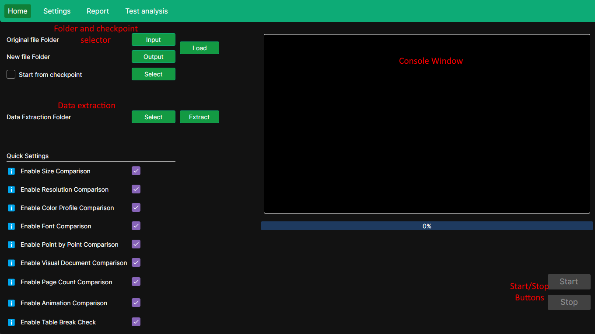
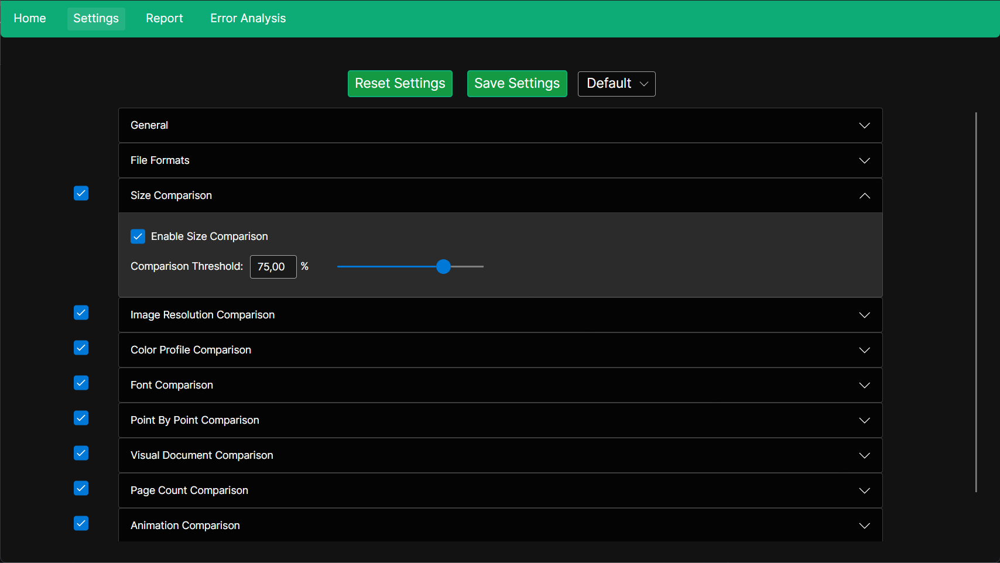
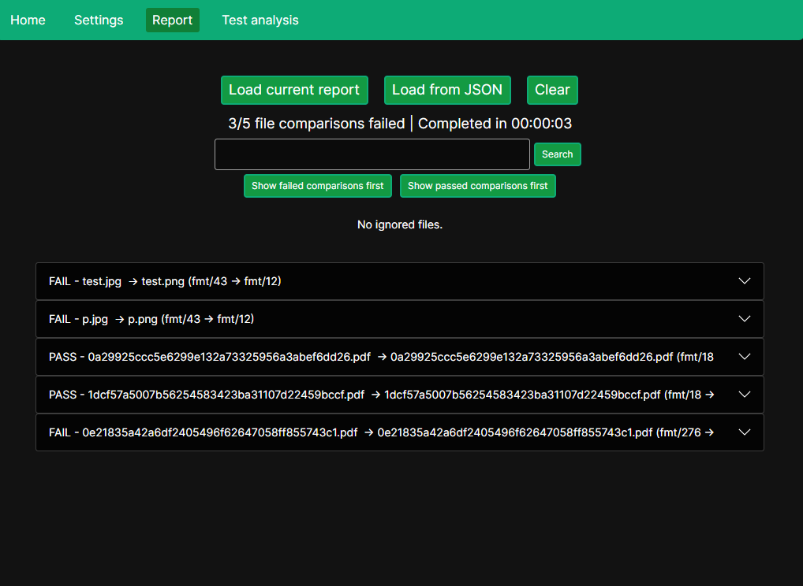
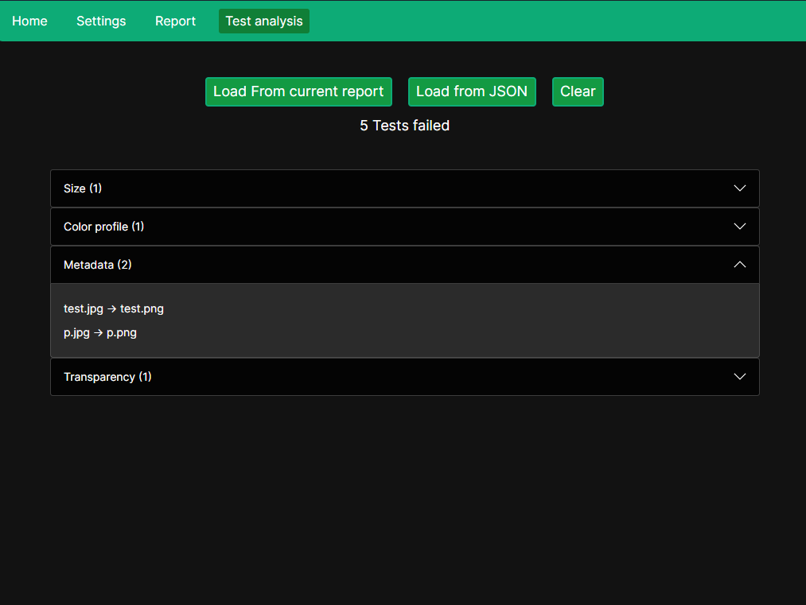
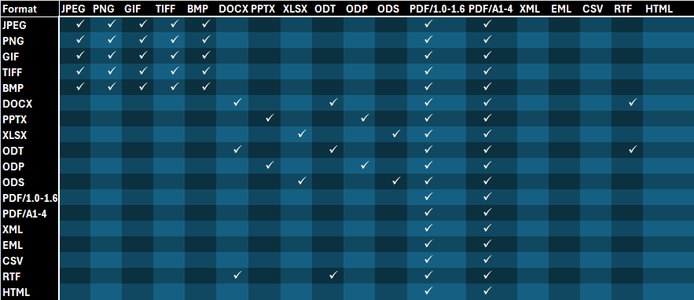

# conv-file-quality-assurance

**conv-file-quality-assurance** is a cross-platform application designed to verify the integrity and quality of files that have been converted from their original format to archival formats. It performs a series of in-depth comparisons and checks, such as visual differences, metadata mismatches, and structural inconsistencies, to ensure the preservation process retains fidelity.

---


## 📚Table of contents
- [Background & Motivation](#background)  
- [Key Features](#key-features)  
- [Comparison Methods](#comparison-methods)  
- [Screenshots & UI Overview](#screenshots--ui-overview)  
- [Supported File Formats](#supported-file-formats)
   -[Comparison Methods in Supported Pipelines](#Comparison-Methods-in-Supported-Pipelines)
- [Installation](#installation)  
  - [Windows](#windows)  
  - [Ubuntu 22.04](#ubuntu-2204)  
- [Usage Guide](#usage-guide)  
- [Known Issues & Limitations](#known-issues--limitations)  
- [Testing & Validation](#testing--validation)  
- [License](#license)  
- [Third-Party Licenses](#third-party-licenses)  
- [Contributing](#contributing)  

---

## 🏛️Background

This project is a proposal from Innlandet Fylkeskommune for a bachelor thesis at NTNU's programming program. It addresses a key issue in the automatic conversion of documents to archival formats—namely, the potential for errors and inconsistencies during conversion.

The Innlandet County Archive, one of Norway’s largest inter-municipal archives, receives a wide variety of digital documents from 48 municipalities. Many of these documents arrive in formats not suited for long-term archival storage, requiring conversion to approved archival formats.

A previous NTNU thesis developed an automated conversion tool. However, during conversion, loss of data or visual discrepancies can occur. Because of the large volume of files, manual inspection is not feasible.

To solve this, the archive requested the development of a quality assurance tool that can automatically detect potential issues in converted files. This project aims to fulfill that need—reducing manual work and increasing reliability in the archival process.

---

## 🚀Key features
- Pixel-by-pixel visual comparisons of images or document pages
- Detection of metadata differences (resolution, color space, bit depth, etc.)
- Table break detection in spreadsheets converted to PDFs
- Font, animation, and transparency detection
- PDF page count comparisons
- Extraction and verification of embedded images
- JSON report generation with severity-based error classification

---

## 🧪Comparison Methods 
Each method performs a specific type of comparison between original and converted files:

- **File Size** – Compares raw file sizes.
- **Pixel-by-Pixel** – Calculates Euclidean distance between color values for each pixel.
- **Color Space** – Identifies missing or altered color spaces.
- **Fonts** – Flags missing or replaced fonts.
- **Number of Pages** – Detects discrepancies in page count.
- **Animations** – Flags the presence or absence of animations in presentation files.
- **Image Resolution** – Compares DPI and resolution metadata.
- **Visual Document Comparison** – Hybrid method: compares document layout + pixel comparisons.
- **Transparency Check** – Detects use of transparency layers.
- **Table Break Check** – Flags if tables/images are split across multiple pages in PDFs.
- **Metadata Comparison** – Compares physical dimensions, bit depth, resolution, etc.
- **Extracted Metadata Check** – Extracts images from documents and checks embedded metadata  
  _NOTE: This method may trigger frequently; severity could be reduced._

---

## 🖼️Screenshots & UI Overview

### Home Screen  


### Settings Tab  
Customize which checks are performed.  


### Report Tab  
Visual interface for exploring the generated JSON reports.  


### Test Analysis Tab  
Get a summary of test failures by severity.  


---

## 📂Supported File Formats



---

### 🔎Comparison Methods in Supported Pipelines
The comparison is performed by functions called pipelines. Pipelines compare the original file to the converted file. In this list they follow the [original_format]-[converted_format] name schema.

- `CSV-PDF`
  - File Size Comparison
  - Table break Checks
- `DOCX-PDF&TextDoc`\*
  - Font Comparison
  - Page Count Comparison
  - File Size Comparison
  - Color Profile Comparison (extracted) 
  - Image Metadata Comparison (extracted)
- `EML-PDF`
  - Font Comparison 
  - Color Profile Comparison (extracted)
  - Image Metadata Comparison (extracted)
- `HTML-PDF`
  - Font Comparison
- `IMG-IMG`\*\*
  - File Size Comparison
  - Resolution Comparison
  - Image Metadata Comparison
  - Pixel Value Comparison
  - Color Profile Comparison
- `IMG-PDF`\*\*
  - File Size Comparison
  - Resolution Comparison
  - Image Metadata Comparison
  - Pixel Value Comparison
  - Color Profile Comparison
- `ODP-PDF`
  - Font Comparison
  - Page (slide) Count Comparison
  - File Size Comparison
  - Animation Check
  - Color Profile Comparison (extracted)
  - Image Metadata Comparison (extracted)
- `ODP-Presentation`\*\*\*
  - Font Comparison
  - Page (slide) Count Comparison
  - File Size Comparison
  - Color Profile Comparison (extracted)
  - Image Metadata Comparison (extracted)
- `ODS-PDF`
  - Font Comparison
  - File Size Comparison
  - Color Profile Comparison (extracted)
  - Image Metadata Comparison (extracted)
  - Table Break Check
  - Check for blank pages at the end
- `ODS-Spreadsheet`\*\*\*\*
  - Font Comparison
  - File Size Comparison
  - Color Profile Comparison (extracted)
  - Image Metadata Comparison (extracted)
- `ODT-PDF&TextDoc`\*
  - Font Comparison
  - Page Count Comparison
  - File Size Comparison
  - Color Profile Comparison (extracted)
  - Image Metadata Comparison (extracted)
- `PDF-PDF`
  - Font Comparison
  - Page Count Comparison
  - File Size Comparison
  - Color Profile Comparison (extracted)
  - Image Metadata Comparison (extracted)
  - Visual Document Comparison
- `PDF-TextDoc`\*
  - Font Comparison
  - Page Count Comparison
  - File Size Comparison
  - Color Profile Comparison (extracted)
  - Image Metadata Comparison (extracted)
- `PPTX-PDF`
  - Font Comparison
  - Page Count Comparison
  - File Size Comparison
  - Animation Check
  - Color Profile Comparison (extracted)
  - Image Metadata Comparison (extracted)
- `PPTX-Presentation`\*\*\*
  - Font Comparison
  - Page (slide) Count Comparison
  - File Size Comparison
  - Color Profile Comparison (extracted)
  - Image Metadata Comparison (extracted)
- `RTF-PDF&TextDoc`\*
  - Font Comparison
  - File Size Comparison
  - Color Profile Comparison
  - Page Count Comparison
  - Color Profile Comparison (extracted)
  - Image Metadata Comparison (extracted)
- `XLSX-PDF`
  - Font Comparison
  - File Size Comparison
  - Color Profile Comparison (extracted)
  - Image Metadata Comparison (extracted)
  - Table Break Check
  - Check for blank pages at the end
- `XLSX-Spreadsheet`\*\*\*\*
  - Font Comparison
  - File Size Comparison
  - Color Profile Comparison (extracted)
  - Image Metadata Comparison (extracted)


\* TextDoc refers to RTF, ODT and DOCX formats \
\*\* IMG referes to PNG, JPEG, BMP, TIFF and GIF formats \
\*\*\* Presentation refers to PPTX and ODP \
\*\*\*\* Spreadsheet refers to ODS and XLSX

---

## 💻Installation

### ✅Windows
#### Dependencies 
- [.NET 8+](https://dotnet.microsoft.com/en-us/download)
- [Siegfried](https://www.itforarchivists.com/) (Add to system PATH)

#### Installation Steps
```bash
git clone --recursive https://github.com/panmat7/conv-file-quality-assurance.git
cd conv-file-quality-assurance
dotnet build
```

---

### 🐧Ubuntu 22.04
#### Dependencies 
- .NET 8+
- [Siegfried](https://www.itforarchivists.com/)
- [Emgu.CV](https://www.emgu.com/wiki/index.php/Download_And_Installation)
- [ExifTool](https://exiftool.org/install.html#Unix)

#### Installation Steps
1. **Install Siegfried**  
   Download and install from: https://www.itforarchivists.com/
2. **Install Emgu.CV**  
   Follow instructions here: https://www.emgu.com/wiki/index.php/Download_And_Installation  
    - If you can't run the Point by point or Visual document comparison, it is probably because of missing dependencies. Check the provided recource and follow the instructions (https://www.emgu.com/wiki/index.php/Download_And_Installation#System.DllNotFoundException)
3. **Install ExifTool**  
   Using `apt`:
   ```bash
   sudo apt-get install libimage-exiftool-perl
   ```
   Or follow the instructions at: https://exiftool.org/install.html#Unix

4. **Install .NET 8 SDK**  

5. **Clone and Build the Project** 
```sh
git clone --recursive https://github.com/panmat7/conv-file-quality-assurance.git
cd conv-file-quality-assurance
dotnet build
```

---

## 📘Usage Guide

1. **Choose original and converted folders.**  
   To extract metadata only, select a single directory and press **"Extract"**.

2. **Click "Load"** to pair original and converted files.  
   Optionally load from a **checkpoint JSON** to resume interrupted runs.
   - To do this, check **"Start from Checkpoint"** and select a saved checkpoint JSON report.

3. **Configure checks** using the **Settings** tab or **Quick Settings**.
   - You can also exclude certain file formats from verification in the Settings tab.

4. **Click "Start"** to begin the verification process.

5. Once complete, a JSON report will be saved in the `reports/` folder (created in the working directory).

6. **View the report**:
   - Go to the **"Report"** tab.
   - Click **"Load from JSON"** and select the report to view results.

7. **Test Analysis Tab**:
   - Navigate to the **"Test Analysis"** tab to view a general overview of test failures by severity.

> ⏳ **Note**: The console prints progress every 5 minutes with estimated time remaining.  
> ⚠️ **Severity Levels**: Errors are categorized as **Low**, **Medium**, or **High**.  
>    - **Low** should be considered warnings and not always critical.

---

## ⚠️Known Issues & Limitations

- **Table break check** currently works only for PDFs with standard A4 or letter-sized pages.
- **Extracted metadata comparison** may over-report differences. We are evaluating lowering the severity of these alerts.
- Some Emgu.CV-based checks may not function if system dependencies are missing (especially on Linux).

---

## ✅Testing & Validation

- Application manually tested on:
  - **Windows 10 & 11**
  - **Ubuntu 22.04**
- JSON output reports pass internal consistency checks.
- Planned: Schema validation for report files to ensure correctness.

---

## 📄License

This project is licensed under the [GNU GENERAL PUBLIC LICENSE v3.0](LICENSE).

---

## 📦Third-Party Licenses

This project uses external libraries such as Emgu.CV, ExifTool, and Siegfried.  
See the [NOTICE](NOTICE) file for third-party license information.

---

## 🤝Contributing

We are not accepting contributions for now. 
